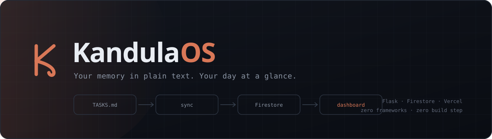
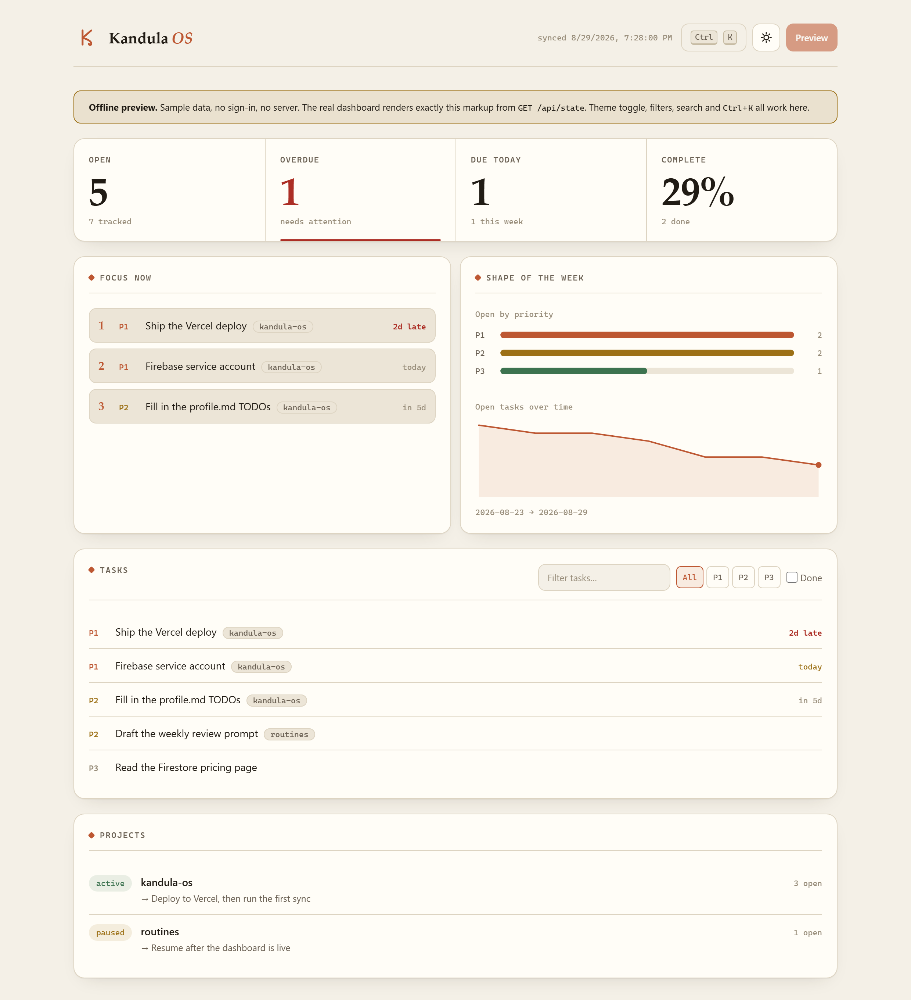
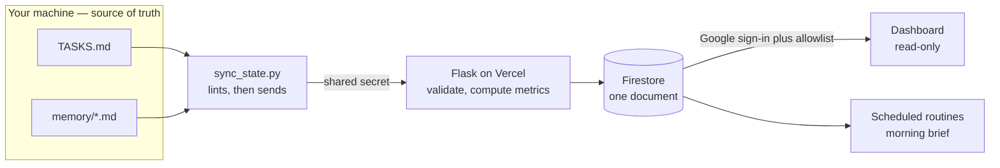

<p align="center">
  
</p>

<p align="center">
  <a href="https://kandula.studio/kandula-os/"></a>
  <a href="https://github.com/kandulanikhilvarma/kandula-os/actions/workflows/ci.yml"></a>
  <a href="LICENSE"></a>
  
  <a href="https://docs.astral.sh/ruff/"></a>
  
</p>

A personal operating system for one person: **markdown files you edit by hand**,
**scheduled routines** that read them, and **one dashboard** that shows where the
week actually stands.

No app to log into to add a task. No database to migrate. `TASKS.md` is the
system; everything else is a view of it. Delete the deployment and you still
have your OS.

> Named for the elephant — the animal that remembers. Kandula is also a family
> name, which made the choice easy.

<p align="center">
  <a href="https://kandula.studio/kandula-os/"><b>▶ Open the live dashboard</b></a>
  &nbsp;·&nbsp; real CSS, real rendering code, sample data — no sign-in, no server
</p>

## Why it is shaped this way

Most personal task systems fail the same way: the tool becomes the work. This one
inverts it. The files are the source of truth and live on your disk in a format
you can read without any software. The cloud half is a **read-only mirror** whose
entire job is answering "what is on fire today" from a phone.

That constraint buys a lot:

- **Nothing to sync back.** One writer (you, in a text editor), one direction.
  No merge conflicts, no offline queue, no reconciliation logic.
- **Your data outlives the code.** Every task is a line of markdown.
- **It fits in your head.** Four runtime dependencies, no framework, no build
  step: ~410 lines of backend Python, ~385 of tooling scripts, and ~1,100 of
  hand-written HTML, CSS and JavaScript.

## Dashboard

One page. Server-computed metrics, filterable task list, a command palette on
<kbd>Ctrl</kbd>+<kbd>K</kbd>, light and dark themes, and the last synced state
cached locally so a reload paints before the network answers.

<p align="center">
  <a href="https://kandula.studio/kandula-os/"></a>
</p>

<p align="center"><sub>The live preview, rendered from sample data · <a href="https://kandula.studio/kandula-os/">open it →</a></sub></p>

## How it fits together



Full diagrams — sync sequence, auth flow, data model, trust boundaries — are in
**[docs/ARCHITECTURE.md](docs/ARCHITECTURE.md)**.

### See it without deploying anything

**Hosted:** [kandula.studio/kandula-os](https://kandula.studio/kandula-os/)
— published from `docs/preview.html` by the [Pages workflow](.github/workflows/pages.yml)
on every push. No Firebase, no secrets.

**Local:**

```bash
python -m http.server 5050
# open http://localhost:5050/docs/preview.html
```

Either way it renders the real dashboard — same CSS, same rendering code — against
sample data, with no server and no sign-in. Theme toggle, filters, search and the
command palette all work.

## Quickstart

```bash
git clone https://github.com/kandulanikhilvarma/kandula-os.git
cd kandula-os
pip install -r requirements-dev.txt
python -m pytest -q                    # 47 tests, no network, no credentials
python scripts/sync_state.py --check   # lint TASKS.md and memory/
```

Running the dashboard needs a Firebase project. The full click-path is in
**[docs/DEPLOY.md](docs/DEPLOY.md)**; `python scripts/preflight.py` tells you
exactly which environment variables are still missing before you start.

```bash
cp .env.example .env.local             # fill in your values
python scripts/preflight.py            # verify before deploying
flask --app api.index run              # http://localhost:5000
```

## The three files that are the system

| File | What it holds |
|---|---|
| `profile.md` | Working memory: who you are, active projects, standing preferences. Always loaded by a routine. |
| `TASKS.md` | Every task, one per line, strict format. The single source of truth. |
| `memory/<project>.md` | One file per project: `status:` and `next:` headers, then free-form notes and a decision log. |

`TASKS.md` uses one line format and the sync script enforces it:

```markdown
- [ ] P1 Deploy the dashboard | due:2026-07-19 | project:kandula-os
- [x] P2 Confirm the build brief
```

`P1` must-do-today, `P2` this-week, `P3` someday. `due:` and `project:` are
optional. Anything else on the line is rejected **with a line number**, on your
machine, before it reaches the network:

```
$ python scripts/sync_state.py --check
TASKS.md / memory drift — 2 problem(s):
  line 19: does not match `- [ ] P1 Title | key:value`
    - [ ] P9 Bad priority
  line 20: due date must be YYYY-MM-DD
    due:20-07-2026
```

## Commands

```bash
python scripts/sync_state.py --check     # validate formatting, change nothing
python scripts/sync_state.py --dry-run   # print the exact payload, send nothing
python scripts/sync_state.py             # lint, then push to the dashboard
python scripts/preflight.py              # verify env vars before a deploy
python scripts/check_mermaid.py          # diagrams still render on GitHub
python -m pytest -q                      # full suite
ruff check .                             # lint
```

## Repo layout

```
profile.md  TASKS.md  ROUTINES.md   the OS core — plain markdown, no code
memory/                             one file per project
api/
  index.py                          Flask app, CSP, error handlers
  routes/state.py                   auth, ETag, request shape only
  services/metrics.py               pure functions — every number lives here
  services/firebase_client.py       the only file importing firebase_admin
  models/schemas.py                 pydantic, extra fields forbidden
templates/  static/                 one page, vanilla JS and CSS, no build step
scripts/                            sync, preflight, mermaid gate
docs/                               brief, architecture, deploy guide
tests/                              47 tests, fully offline
```

## Security posture

- **Firestore runs in locked mode.** No client reads it directly; only the server does.
- **Two credentials, two jobs.** The sync script holds a shared secret compared
  in constant time. The browser holds a Google identity checked against an email
  allowlist. Neither can do the other's job.
- **Everything crossing the boundary is validated** by pydantic with
  `extra="forbid"`, so a renamed field fails loudly instead of vanishing.
- **Strict CSP with no `unsafe-inline`.** The Firebase web config travels as a
  `data-` attribute rather than an inline script, so no nonce is needed.
- Secrets live in the Vercel dashboard and `.env.local`. Neither is ever committed.

Reporting a vulnerability: **[SECURITY.md](SECURITY.md)**.

## Design notes

The dashboard computes nothing. Every count, every "2d late", every ordering
decision comes from [`api/services/metrics.py`](api/services/metrics.py) — pure
functions that take `today` as an argument and touch no I/O. That is why the
numbers are covered by fast unit tests rather than browser assertions, and why
an IST user's "today" is correct: the browser sends its local date, the server
computes against it.

The trend chart needs two syncs before it says anything, and says so rather than
drawing a flat line from a single point.

## License

MIT — see [LICENSE](LICENSE).

---

<p align="center">
  <a href="https://www.linkedin.com/in/nikhilvarmakandula">LinkedIn</a> ·
  <a href="mailto:kandulanikhilvarma@gmail.com">Email</a> ·
  <a href="https://kandula.studio">Portfolio</a>
</p>
