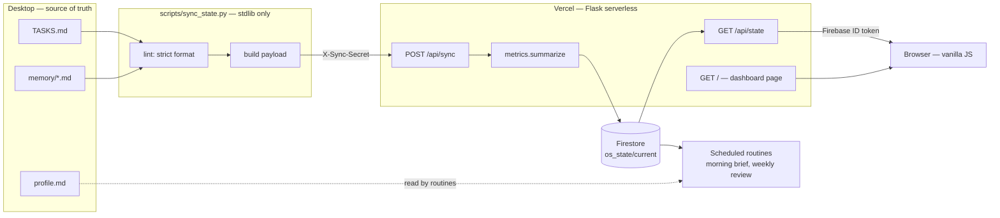
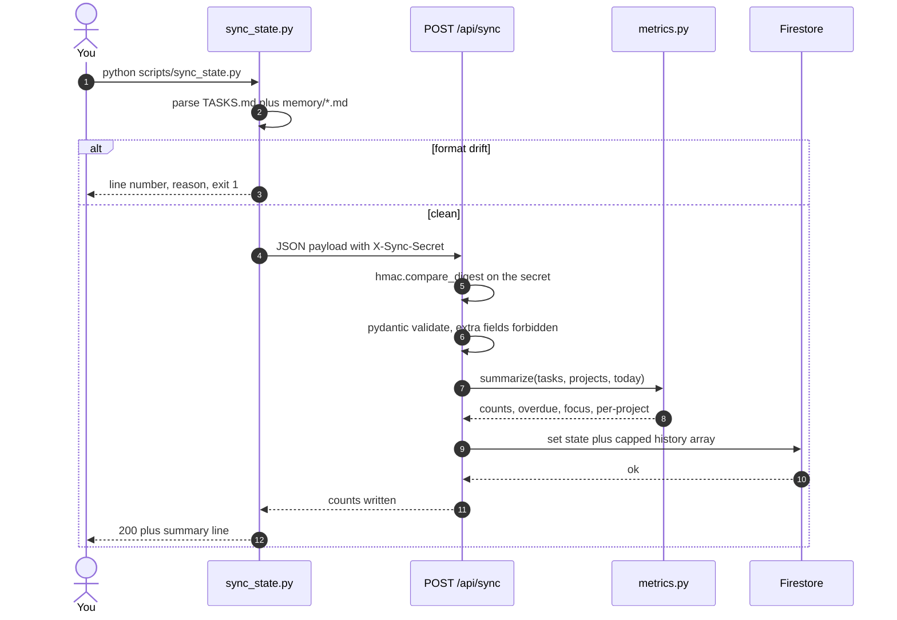
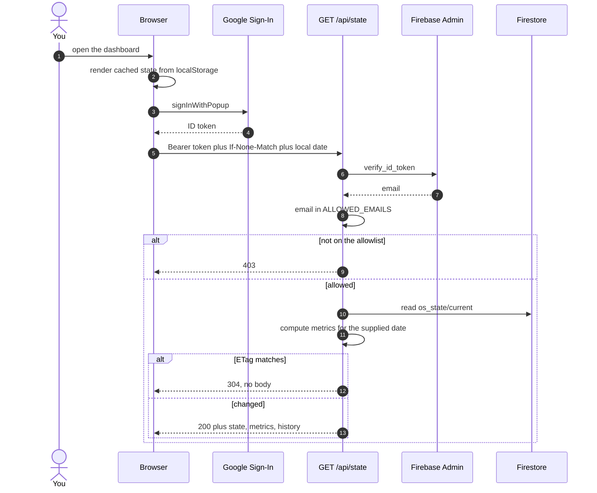
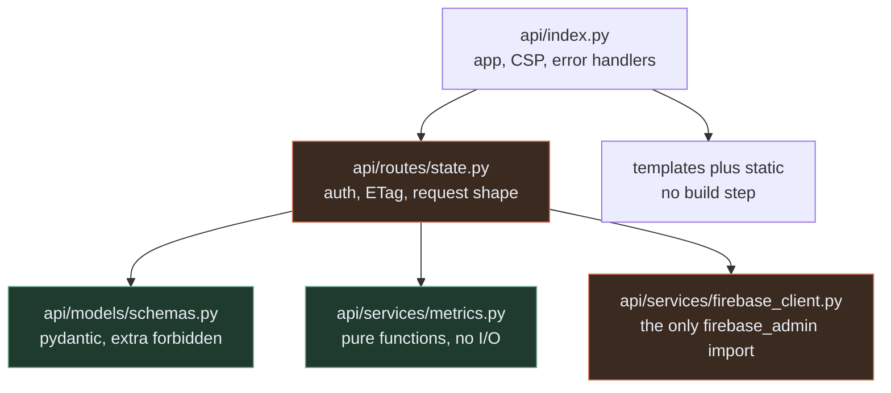
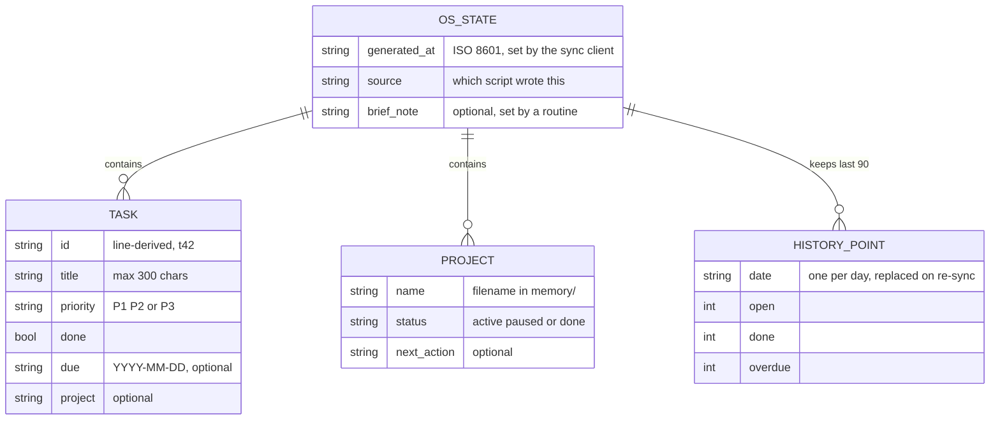
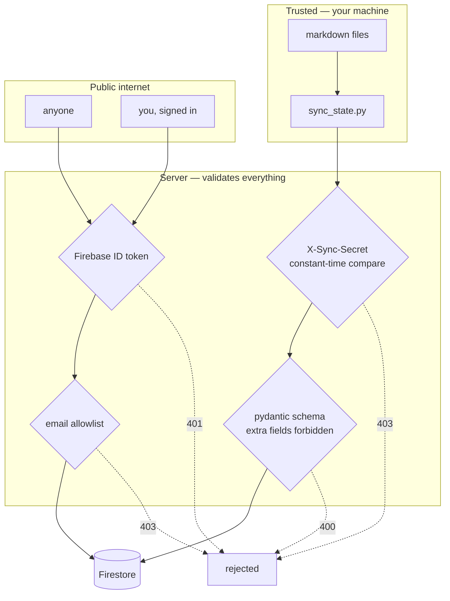

# Architecture

Kandula OS is three parts that barely know about each other: **markdown files**
you edit by hand, a **sync script** that reads them, and a **read-only dashboard**
that renders whatever was last synced.

The files are the source of truth. Firestore is a cache with a nice view on top.
Delete the whole deployment and you still have your OS.

## System context

Two things carry state into the cloud, and each has its own credential: the sync
script holds a shared secret, the browser holds a Google identity. Neither can do
the other's job.

## Writing state: the sync path

`sync_state.py` refuses to send anything it cannot parse. Drift is caught on the
desktop, with a line number, before it ever reaches the network.

Three gates stand between a typo and the database: the linter, the shared secret,
and the schema. Each rejects a different class of mistake.

## Reading state: the dashboard path

The page paints from `localStorage` before the network answers, so a reload feels
instant and an offline reload still shows the last known state. `If-None-Match`
means an unchanged dashboard costs one empty 304 rather than a full payload.

## Module map

The rule that keeps this small: **routes stay thin, services stay pure, one file
owns the SDK.** `metrics.py` takes `today` as an argument and touches nothing
else, so every number on the dashboard is reproducible in a unit test. Swapping
Firestore for anything else means rewriting one file.

## Data model

One document. No collections-per-entity until something actually needs history
beyond the rolling window.

`history` lives inside the same document rather than its own collection. One read
serves the entire dashboard, no composite index is ever needed, and 90 points of
four integers is a rounding error against the 1 MB document limit.

## Trust boundaries

Firestore runs in locked mode: **no client ever reads it directly.** The browser
holds an identity, not a database credential. A stolen ID token still has to
belong to an allowlisted email, and it grants read access to one document.

The page ships a strict Content-Security-Policy with no `unsafe-inline`. The
Firebase web config travels as a `data-` attribute on `<body>` rather than an
inline `<script>`, which is why no nonce or hash is needed anywhere.

## Cost and limits

| Concern | Where it lands |
|---|---|
| Firestore reads | 1 per dashboard load, 0 on a 304 |
| Firestore writes | 1 per sync, and syncs are manual |
| Cold start | one `firebase_admin` init, cached on the module for warm invocations |
| Response time | no external call on the page route; well inside Vercel's 10s limit |
| Payload | one document, capped history, 200-task schema ceiling |

Everything fits the free tier for a single user, which was the point.

## Deliberate omissions

Writing tasks from the browser (the files are the source of truth, and a second
writer means conflict resolution) · multi-user or roles · a task history beyond
90 points · a framework or build step · a background worker · charts beyond the
two that answer "what is on fire" and "am I trending down".

Each of these is a real feature. None of them is needed by one person keeping
their week straight, and each would cost more than it returns today.
